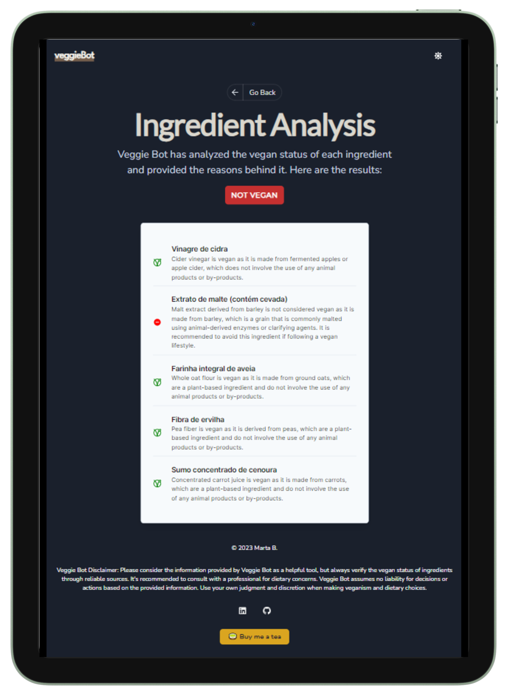

# VeggieBot 🌱

VeggieBot is a web application that helps you discover the vegan status of ingredients instantly. It empowers you to make informed choices and lead a cruelty-free and sustainable way of living.

## Features

- Instantly check the vegan status of ingredients;
- User-friendly and accessible interface;
- Light/Dark mode;
- Mobile friendly.

## Features backlog

- [ ] File Upload (.csv, .txt or others);
- [ ] Ingredient scanner through device camera

## Technologies Used

- [Chakra UI](https://chakra-ui.com/): For building the user interface with style and accessibility in mind.
- [Next.js](https://nextjs.org/): For server-side rendering and creating a fast and efficient web app.
- [React](https://reactjs.org/): To build the front-end user interface components.
- [Open AI GPT-3.5](https://platform.openai.com/docs/api-reference): For generating vegan status of ingredients.

## Installation

1. Clone the repository: `git clone https://github.com/MartaBento/veggie-bot.git`
2. Install dependencies: `npm install`
3. Run the development server: `npm run dev`
4. Open your browser and go to `http://localhost:3000` to see VeggieBot in action.

## Usage

1. Choose the product to analyse and copy its ingredient list;
2. Paste the ingredient list into the input field and click the Analyze button;
3. Wait for the results to be displayed in the `results` page.

## Contributing

Contributions are welcome! If you find any issues or want to add new features, please open an issue or submit a pull request.

## Contact

Connect with me on LinkedIn or GitHub for any questions or discussions related to VeggieBot:

- [LinkedIn](https://www.linkedin.com/in/marta-bento)
- [GitHub](https://github.com/MartaBento)
